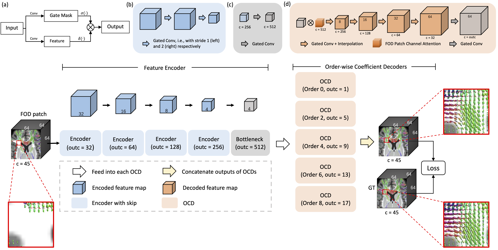

# OCE-Net

Official implementation of OCE-Net for FOD inpainintg

<!--  -->



## Training
```
python3 /OCE-NET/train.py \
--dataroot /data/HCP \
--checkpoints_dir ./checkpoints \
--name ocenet_fodnorm_zscore_f3 \
--model lesion_inpaint_5loss \
--input_nc 45 \
--output_nc 45 \
--init_type kaiming \
--dataset_mode fod \
--num_threads 0 \
--batch_size 4 \
--beta1 0.99 \
--lr 0.001 \
--n_epochs 50 \
--print_freq 1000 \
--save_latest_freq 20000 \
--save_epoch_freq 10 \
--gpu_ids 0 \
--conv_type ocenet \
--test_fold 3 \
```

## Inference
```
python3 /OCE-NET/test.py \
--dataroot /data/HCP \
--checkpoints_dir ./checkpoints \
--name ocenet_fodnorm_zscore_f3 \
--model lesion_inpaint_5loss \
--input_nc 45 \
--output_nc 45 \
--init_type kaiming \
--dataset_mode fod \
--batch_size 4 \
--gpu_ids 1 \
--conv_type ocenet \
--test_fold 3 \
```
